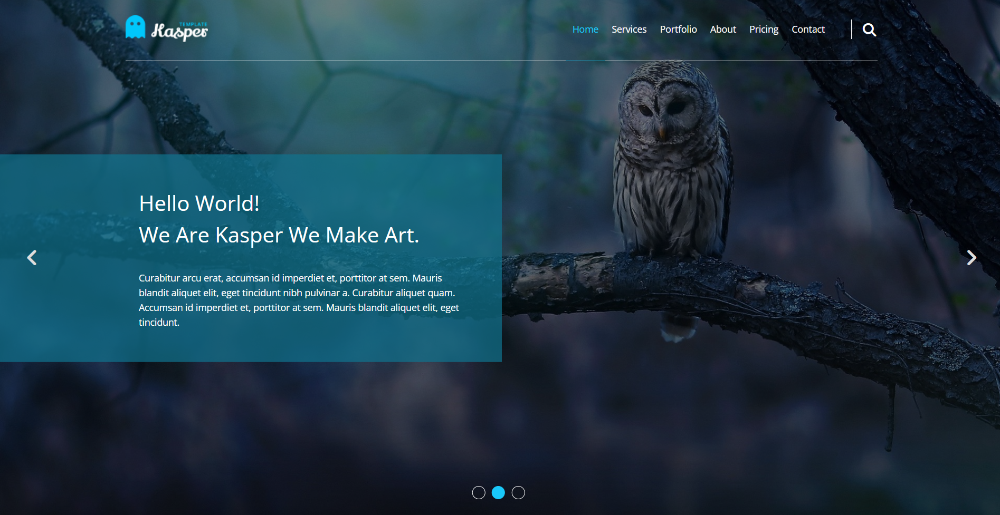

# 🚀 Kasper Landing Website UI (HTML & CSS)

This is a modern multi-section landing page built as a front-end practice project. It focuses on clean UI design, structured layout, and responsive behavior across different screen sizes using modern CSS techniques.

🧩 Project Type: Multi-section Landing Page
---

## 🛠 Built With
 ✔️ HTML  
 ✔️ CSS

---

## 📸 Preview

---

## 🎯 Key Features & Concepts Practiced

✔️ Semantic HTML structure for better readability and SEO  
✔️ Flexbox-based layout system for structured sections  
✔️ Fully responsive design using media queries  
✔️ Clean and modern UI design implementation  
✔️ Google Fonts integration for typography  
✔️ Font Awesome icons usage  
✔️ Smooth scrolling behavior  
✔️ Advanced positioning (relative & absolute)  
✔️ Hover effects and transitions  
✔️ Organized and maintainable CSS structure  

---

## 🌐 Live Preview 
🔗 https://mkandil4.github.io/kasper-website-ui/

---

## 📁 Project Structure

Template-Two/
├── index.html
├── css/
│ └── Kasper.css
├── images/
└── webfonts/

---

## 👤 Author  
**Mohamed Kandil**

🔗 GitHub: https://github.com/MKandil4  
🔗 LinkedIn: https://www.linkedin.com/in/mkandil4  

---

## 💬 Feedback  
Feel free to open an issue or submit feedback — all suggestions are welcome! 🙌

